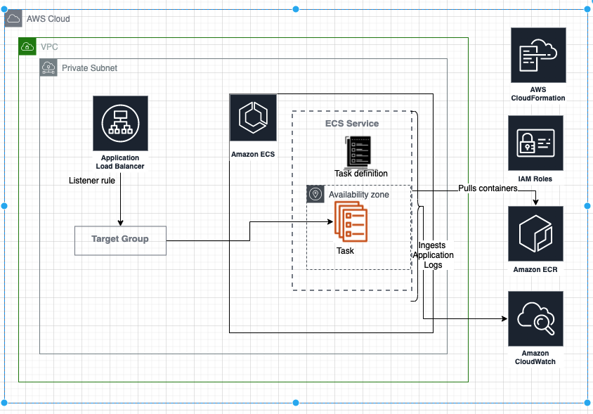

# Products-api
Proof of concept API interface which provides users to do CRUD operation on products and it's options
## Highlights
- API server exposes basic endpoints `/health` and `/products` (Use explained below) .
- Repository follows [The Twelve-Factor App](https://12factor.net) approach
- Build and deploy follows [3 musketeers](https://amaysim.engineering/the-3-musketeers-how-make-docker-and-compose-enable-us-to-release-many-times-a-day-e92ca816ef17) approach of docker-compose, dockerfile and Makefile
- **Kotlin** for Code and unit-testing
- **Nodejs** for integration testing
- Code is built, linted, unit tested, integration tested and pushed to artifact( specified or by default ECR)
- Deployed to **AWS ECS-Fargate**. Exposes the ALB endpoint to connect to the API endpoint
- **Terraform** for infra structure as code 
- **Buildkite** pipeline for CI/CD. Pipeline builds,tests, build and push the image and deploy to AWS.

## API endpoint
The endpoint exposes following 
1. `GET /products` - gets all products.
2. `GET /products?name={name}` - finds all products matching the specified name.
3. `GET /products/{id}` - gets the project that matches the specified ID - ID is a GUID.
4. `POST /products` - creates a new product.
5. `PUT /products/{id}` - updates a product.
6. `DELETE /products/{id}` - deletes a product and its options.
7. `GET /products/{id}/options` - finds all options for a specified product.
8. `GET /products/{id}/options/{optionId}` - finds the specified product option for the specified product.
9. `POST /products/{id}/options` - adds a new product option to the specified product.
10. `PUT /products/{id}/options/{optionId}` - updates the specified product option.
11. `DELETE /products/{id}/options/{optionId}` - deletes the specified product option.

Product model:
```
{
    "id": "1d83f23b-9016-42e9-b8d8-ea104756dd51",
    "name": "name of the product",
    "description": "description of the product",
    "price": 10.0,
    "deliveryPrice": 2.0
}
```
Options model:
```
{
  "id": "e2a93ce9-8c41-4faa-b077-20abb4e590fff",
  "name": "Name of the product option",
  "description": "Description of the product option"
}
```

# Guide
## Assumptions/Dependencies
Repository follows `3 musketeers` approach, hence it has very minimal dependencies
* **Docker Engine**: Make target relies on docker running on the system.
* **GNU make**: All the commands are run through Makefile targets. Makefile targets reflect the application life cycle.
* **AWS access**: Deployment assumes access to the target AWS account and all the required AWS access config is done.
## Usage

```
# 1. Build and unit testing the code.
make build

# 2. Run integration tests
make test

# 3. Build docker image
make build_image

# 4. Tag image: Tags with the artifact url and path. If artifact url is not provided, then it's defaulted to ECR
make tag_image

# 5. Push image: Pushes the image to specified artifact
make push_image

# 6. Deployment: Infrastructure deployed using terraform. Two steps of terraform: plan and deploy
make infra_plan
make infra_deploy

# 7. Destroy of infrastructure deployment
make destroy

# 8. If ECR as repository, then commands to login and create the artifact
make ecr_login
make ecr_create_repository
```

## Dev commands
```
# 1. Fix terraform formatting errors
make infra_format
# 2. Diagnose deployment errors/failures
make infra_shell
```

# Repository walk-through
## Kotlin programming language for code and unit testing
Reason for choosing kotlin programming language
* Been using `Kotlin`, `Nodejs` and `Python` actively. However, modeling requirement makes Kotlin to fit in very easily.
* Ease of exposing REST endpoint. 
* Testing: Like any other programming language, can easily be broken into smaller components. Hence the testing can be done in smaller units

## Source code

* `./src/main` directory host the source code.
* Code broken into self explanatory, smaller testable units.
## Unit Testing
* `./src/test` directory host the unit test code
* Testing: `Kotlin-test` as the framework for testing
* Directory structure follows the `src/main` code structure

## Integration Testing
* `node-js` as programming language
* `integration-tests` directory host integrations tests
* Both application container and test container are run in the same docker-network. This helps the test container communicate with the application container
* Test verifies `/health`, /products endpoints

## Deployment and Infrastructure 
* **AWS** as cloud service provider
* Terraform for infra structure as code
* `infra` directory hosts the code
* AWS ECS Fargate to host the task
* API server is behind the `Internal Load balancer`

## CI/CD

* **Buildkite** for CI-CD pipeline
* Invokes make targets for build, push and deploy
* **Assumption**: Buildkite agent names for build and deployment are assumed. This needs to fixed when connecting to buildkite.

# AWS Deployment

- ECS Cluster using fargate
- Task definition hosts API server container definitions
- Docker image pulled from Artifact, defaults to ECR.
- Application Load Balancer(**ALB**) forwards to TargetGroup and exposes **private** DNS.
- Target Group does health check on service port which verifies the health of the application.
- Containers are run in **private** subnet
- Container logs updated to **CloudWatch** log group

## Security:

### Internal ALB: 
- Ideally API endpoints(in case of multiple servers) should be internal and backed with public BFF endpoint
- For simplicity ALB is not associated to ACM certificate, hence exposing HTTP endpoint
- To avoid the attack factor, ALB is **internal** and is not exposed to the internet
- For testing the deployment: Connect to a bastion-box within the VPC and hit the endpoint

### Security Group
- ALB security group allows only port 80
- Source should be within the VPC


## Architecture


                
# Pending

## Reliability

Api task/container holds the data. This is not a `product-scale` architecture. I wanted to hold the data is a AWS/any-other managed database. 
May be `RDS`, `Mongo-Atlas` or `dynamo` would have been good choices
Due to time constraint for this task, chose to put add in the running container. 

## Deployment testing

* Due to security reasons explained before ALB is hosted in private subnet hence will not be reachable outside the VPC.  Also security group only allows origin to be within VPC.
* Since ALB is unreachable, testing becomes difficult to run from test machine or buildkite agent

### Approach: Lambda to run deployment testing.
To reach the internal ALB, test needs to be run with the VPC. Best option be will be to trigger the lambda and hit the internal ALB host-name and verify the deployment
